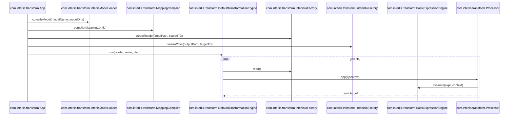

# interlis-transform-engine

```mermaid
sequenceDiagram
    participant App as com.interlis.transform.App
    participant Loader as com.interlis.transform.InterlisModelLoader
    participant Compiler as com.interlis.transform.MappingCompiler
    participant Engine as com.interlis.transform.DefaultTransformationEngine
    participant Reader as com.interlis.transform.InterlisIoFactory
    participant Writer as com.interlis.transform.InterlisIoFactory
    participant Expr as com.interlis.transform.BasicExpressionEngine
    participant Proc as com.interlis.transform.Processor

    App->>Loader: compileModel(modelName, modelDirs)
    App->>Compiler: compile(MappingConfig)
    App->>Reader: createReader(inputPath, sourceTD)
    App->>Writer: createWriter(outputPath, targetTD)
    App->>Engine: run(reader, writer, plan)

    loop events
        Engine->>Reader: read()
        Engine->>Proc: apply(context)
        Proc->>Expr: evaluate(expr, context)
        Proc-->>Engine: emit target
    end
```
