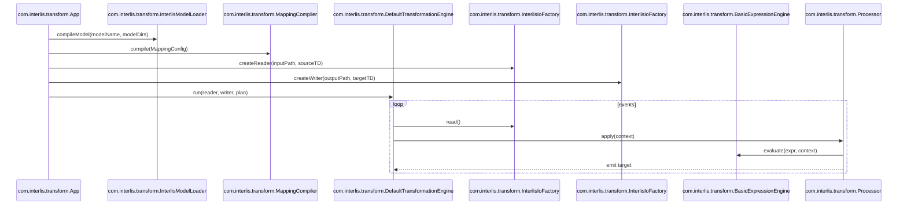

# interlis-transform-engine

## DSL-Ausdruckssyntax

Die Mapping-Ausdrücke unterstützen eine kleine DSL für Attribute, Literale, Operatoren und Funktionen:

### Literale
- Strings mit einfachen oder doppelten Anführungszeichen, z. B. `'Text'` oder `"Text"`.
- Zahlen wie `42` oder `3.14`.
- Boolesche Werte `true`/`false`.
- `null`.

### Pfade und Kontext
- Quellattribute: `${src.<attr>}` oder `${src.<alias>.<attr>}` für Multi-Source-Mappings.
  - Bei einem Alias wird der erste Teil nach `src.` als Alias interpretiert, wenn er in den bekannten Sources vorhanden ist.
  - Attribute können weitere Punkte enthalten (z. B. strukturierte Attribute).
- Zustandszugriff: `${state.<sourceOid>}` liefert die gemappte Target-OID.

### Operatoren
- Vergleich: `==`, `!=`
- Addition: `+` (numerisch; mehrere Summanden möglich)

### Funktionen
- `substring(value, start, length)`
- `coalesce(a, b, ...)`
- `add(a, b, ...)` (wird intern bei `+` verwendet)
- `if(condition, whenTrue, whenFalse)`
- `to_xml_date(value, pattern?)`
- `to_xml_datetime(value, pattern?)`
- `from_xml_date(value, pattern?)`
- `from_xml_datetime(value, pattern?)`
- `ref(role)` bzw. `ref(alias, role)` löst Rollenreferenzen über OID auf und liefert das referenzierte Objekt (oder `null`).
  - Die Zielklasse wird über ili2c-Metadaten (Viewable/Rolle) ermittelt.
  - Der Lookup verwendet die aktuelle Basket-ID oder eine in der Referenz gespeicherte Basket-ID.
